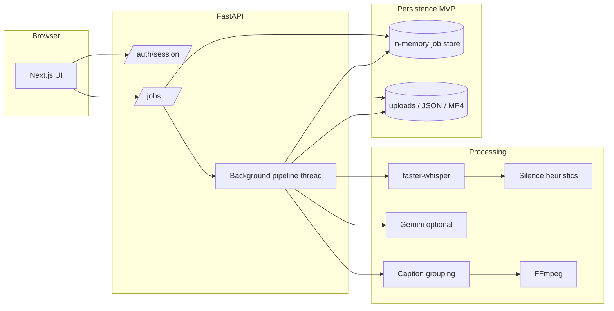

# Shortcut — Project overview

**Shortcut** is an MVP **AI-assisted video editor**: users upload a clip, the backend transcribes it with word-level timing, derives a speech/silence timeline, optionally refines narrative copy with Gemini, builds captions (with optional burn-in), and exports a **rough-cut MP4** from kept segments via FFmpeg. The **Next.js** app handles auth, job creation, upload, and status polling.

This document complements the root [`README.md`](../README.md) (quick start and prerequisites).

---

## Goals (MVP scope)

- One-shot pipeline after upload: transcribe → timeline → best-take metadata → captions → export.
- Browser UX for create job, upload video, watch step progress, open preview when export succeeds.
- Local-first artifacts on disk under configurable roots; **job metadata is in-memory** (not durable across restarts).

---

## Repository layout

| Area | Role |
|------|------|
| [`frontend/`](../frontend/) | Next.js App Router: `/upload`, `/jobs/[jobId]`, shared UI components. |
| [`backend/`](../backend/) | FastAPI app (`app.main`), services (Whisper, silence, captions, FFmpeg, Gemini), background worker, file storage helpers. |
| [`backend/data/`](../backend/data/) | Default upload/output tree (gitignored as appropriate); see environment. |

---

## Architecture

**Authentication:** `POST /auth/session` issues a JWT; subsequent calls can send `Authorization: Bearer …`. The API also accepts `X-User-Id` for simple local dev (`anonymous` if neither is set), resolved in upload routes via `resolve_user_id`.

**Pipeline trigger:** After `POST /jobs/{job_id}/upload` saves the file, a **daemon thread** runs `run_job_pipeline` (see [`background.py`](../backend/app/workers/background.py)). A lock ensures a job only transitions from `queued` once.

---

## Processing pipeline (four steps)

The job model exposes step keys: `silence_removal`, `best_take`, `captions`, `export` (see [`schemas.py`](../backend/app/models/schemas.py)).

1. **Silence removal (transcript + timeline)**  
   - **faster-whisper** produces word-level timestamps.  
   - Silence segments and a **timeline** (`keep_audio` flags) are computed and written to JSON alongside the transcript.

2. **Best take**  
   - For the MVP, the single transcript is treated as one “take”; **Gemini** may run to attach explanation/metadata. If Gemini is missing or errors, the pipeline defaults to take `0`.

3. **Captions**  
   - Words are grouped into caption lines; JSON is persisted.  
   - If `ffmpeg` is on `PATH`, optional **burn-in** produces a video artifact.

4. **Export**  
   - Reads timeline from disk, concatenates **kept** segments with a crossfade, writes rough-cut MP4.  
   - If FFmpeg is missing or export fails, the job can still end **`completed`** with `error_export` set so transcript/captions remain usable (see [`CHANGELOG`](../backend/CHANGELOG.md)).

---

## HTTP API surface

All routes are mounted at the app root (no global `/api` prefix on the FastAPI app).

| Method | Path | Purpose |
|--------|------|---------|
| `GET` | `/health` | Liveness, version, `ffmpeg_available`, `ffmpeg_path`. |
| `POST` | `/auth/session` | Create session JWT. |
| `POST` | `/jobs` | Create job; returns `job_id`. |
| `POST` | `/jobs/{job_id}/upload` | Multipart video upload; queues pipeline. |
| `GET` | `/jobs/{job_id}` | Job status, per-step state, output URLs/paths. |
| `POST` | `/jobs/{job_id}/transcript` | On-demand transcript (separate from automatic pipeline persistence). |
| `POST` | `/jobs/{job_id}/silence-timeline` | Silence/timeline operations for edits flow. |
| `POST` | `/jobs/{job_id}/captions` | Caption generation / burn-in request path. |
| `POST` | `/jobs/{job_id}/export` | Export rough cut (edit flow). |
| `GET` | `/jobs/{job_id}/rough-cut` | Download/stream rough-cut file when available. |
| `POST` | `/retakes/best` | Choose best transcript among multiple takes (Gemini-backed when configured). |

CORS is controlled by **`API_CORS_ALLOW_ORIGIN`** (see below).

---

## Storage and artifacts

- **Configured roots:** `UPLOADS_ROOT`, `OUTPUTS_ROOT` in `.env` (see [`backend/.env.example`](../backend/.env.example)).  
- **Typical layout:** `uploads/{user_id}/{job_id}/` — source video, `transcript.json`, `timeline.json`, `captions.json`, burned video (if any), rough-cut output.  
- **Job records:** In-process store in [`jobs_service`](../backend/app/services/jobs_service.py); restarting the server loses job history.

---

## Configuration highlights

| Variable | Role |
|----------|------|
| `AUTH_SECRET` | JWT signing secret (use a strong value in production). |
| `AUTH_TOKEN_TTL_SECONDS` | Session lifetime. |
| `GEMINI_API_KEY` | Optional; improves best-take / copy paths when present. |
| `WHISPER_MODEL_NAME` | Quality vs. speed tradeoff (`medium`, `large`, `base`, …). |
| `GPU_DEVICE` | e.g. `cuda:0` or CPU; backend may fall back if CUDA unavailable. |
| `FFMPEG_BIN` | Optional full path to `ffmpeg` when it is not on `PATH`. |
| `API_CORS_ALLOW_ORIGIN` | Browser origin(s) allowed to call the API. |

**External binaries:** **FFmpeg** for burn-in and rough-cut export — on `PATH` or set **`FFMPEG_BIN`** in `.env` to the full path of `ffmpeg` / `ffmpeg.exe`.

---

## Frontend behavior

- **`/`** redirects to **`/upload`**.  
- **`/upload`:** Creates a job, uploads the file, navigates to the job page.  
- **`/jobs/[jobId]`:** Polls **`GET /jobs/{id}`** until steps complete or fail; surfaces preview when `roughCutUrl` (or equivalent output) is present.  
- **`NEXT_PUBLIC_API_BASE_URL`** overrides the default API base (typically `http://127.0.0.1:8000`).

---

## Production gaps (explicit MVP choices)

- In-memory job store — no horizontal scale or crash recovery for job state.  
- In-process background worker — replace with a queue (Celery, RQ, cloud worker) for durability and isolation.  
- Single-user / dev-oriented auth — harden JWT issuance, secrets, and CORS for production.  
- Local disk storage — swap for object storage if deploying remotely.

---

## Related documents

- [`README.md`](../README.md) — install, run commands, prerequisites.  
- [`backend/CHANGELOG.md`](../backend/CHANGELOG.md) — backend behavior and dependency changes.  
- [`frontend/CHANGELOG.md`](../frontend/CHANGELOG.md) — frontend changes.
